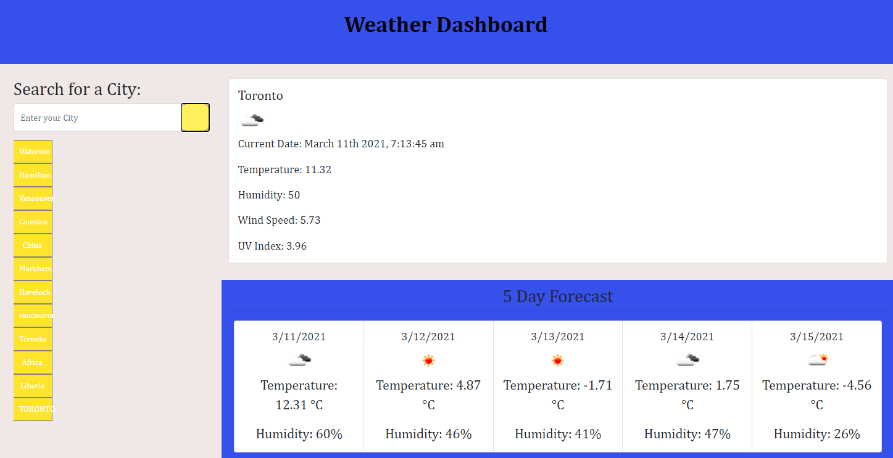

# Project Title: Weather Dashboard

## Description: 
The weather dashboard allows you to search any country or city in the world. You can view all kinds of data on the weather like: temperature, humidity, wind speed, uv index.

Below the weather overview for the city or country you have searched, the website will nicely display in cards and in columns a 5 day focrecast showing temperature and humidity.

The search function allows you to store your searches as well, using local storage and come back to them with an easy click of the button.

 ### Contributing:
 Contributions are made by Jordan Mossing using various technolgies. Some of them include HMTL, CSS, JavaScipt, and a 3rd party API via openweathermap.org

### Test:
Multiple tests were done to get the product working as it was initially visioned. One of the main issues that caused major functionality issues and required troubleshooting was a CORS issue. This only occurred after pushing everything to GitHub and getting the webpage live. After some troubleshooting and testing the issue was resolved.

### Screenshot:
 
### 

### Questions:
 
Reach out to me on my GitHub page at the following Link:
 -[GitHub Profile](https://github.com/jmo1point0)    
 Or by email: jordan.mossing@gmail.com

 ### Link: https://jmo1point0.github.io/homework6/

